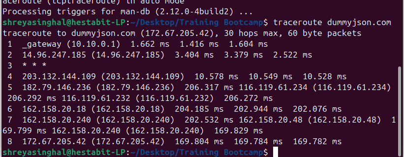
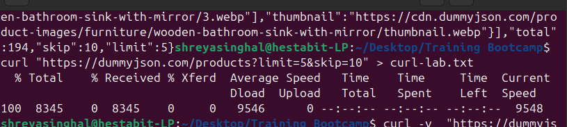
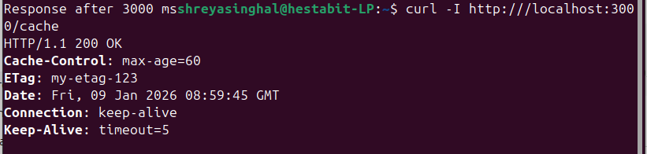
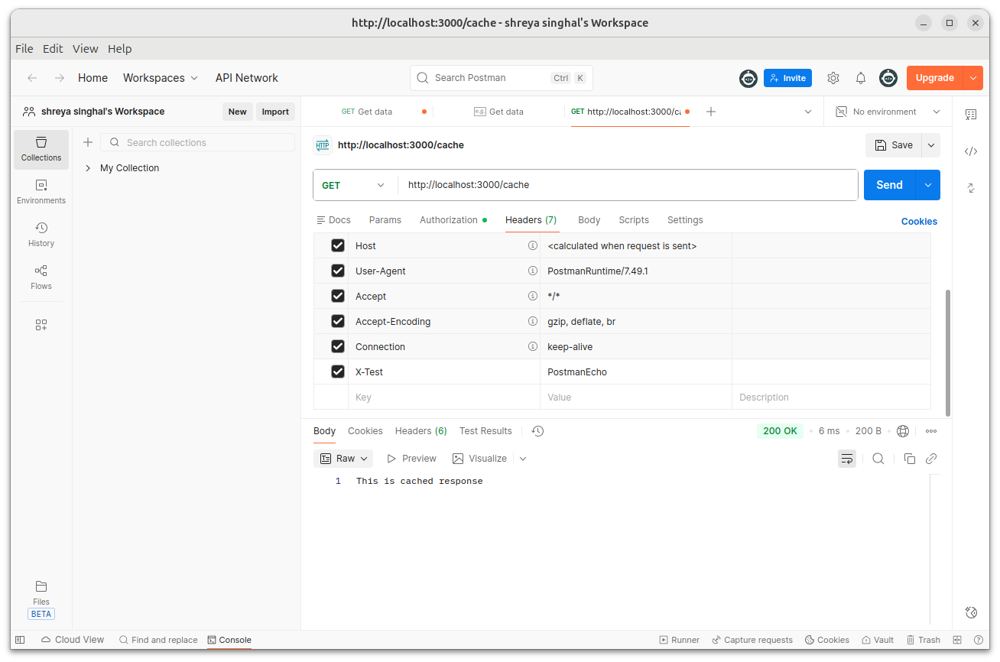

In this task we have performed HTTP/API Forensics through 2 methods
    --1. CURL (Terminal)
    --2. Postman (GUI Tool)

Learning of this task was:
    -- How does API request-response works.
    -- What are headers.
    -- Pagination
    -- ETags
    
TASK1: DNS LOOKUP & TRACEROUTE (CURL)
--We can find IP address of any domain using DNS Lookup.
--With the help of Traceroute we can analyze the route followed by request and see that before reaching server what all network hops have occured in-between.
1.lookup(terminal)----> 
2.traceroute(terminal)--> 

TASK2:PAGINATION (CURL+POSTMAN)
--Pagination means dividing large data into smaller parts called pages, so that the server load is divided.
--We used 2 variables here:
    a.limit: how many records we want.
    b.skip: how many records to skip at start.
1.CURL----> 

2.POSTMAN--> 

TASK3:HEADERS MODIFICATION (CURL+POSTMAN)
--headers are extra info that client sends to the server like user-authorization etc.
--We did 2 main things here:
    a. removed user-agent header.
    b. added fake authorization header.
1.CURL---> 
2.POSTMAN--> 

TASK4:CACHING USING ETAG (CURL+POSTMAN)
--ETag is a unique identifier of server which tells the diff in response. If response is same, server returns 304 Not Modified.
--We perform this task in two basic steps:
    a. Get ETag
    b. Send If-None-Match using etag fetched earlier
1.CURL---->
2.POSTMAN-->

TASK5:CUSTOM NODE HTTP SERVER (CURL+POSTMAN)
--we have created our own node.js server which have different endpoints.
--endpoints created are:
    a.echo: returns request headers.
    b.slow: delays the response.
    c.cache: returns cache related headers.
A.ECHO
1.CURL----->
2.POSTMAN---->
B.SLOW
1.CURL--->
2.POSTMAN-->
C.CACHE
1.CURL------>
2.POSTMAN---->

