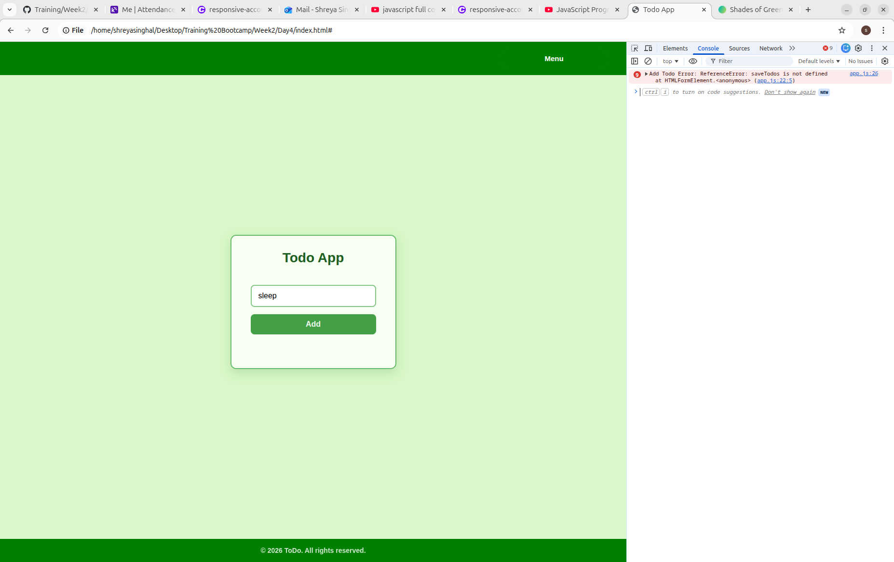

<h1> WEEK2: DAY4 </h1>
 <h3> ERROR 1: Reference Error <h3>
    <h4>Error Generated</h4>
    
when i tried to add element to the todo list, a reference error was thrown on console and nothing would be added to the list.

    <h4>Reason </h4>
    
 I created the saveTodo function inside app.js instead of storage.js.

    <h4> Fix <h4>
    
 Re-checked the code and changed the function location and ensured correct  file order 

    
     
<h3> ERROR 2: TypeError </h3>
<h4>Error Generated </h4>

 The save button was not working when I used to add a new item to the to-do list. 

<h4>Reason</h4>

I used the wrong id of todo-input in DOM.

<h4>Fix</h4>

used the correct id from index.html

 
<h3>ERROR 3: ToDo items not aligned inside a card </h3>
<h4>Error Generated</h4>

elements on the page were not aligned together and it became cluttered as the elements were not properly spaced. 

<h4>Reason</h4>

All the elements were seperately sectioned and there was no parent container to wrap all the elements in one. so alignment got disturbed as everything had its own position without aligning it with the other.

<h4>Fix</h4>

Created a div to wrap all the elements in one single container

 
