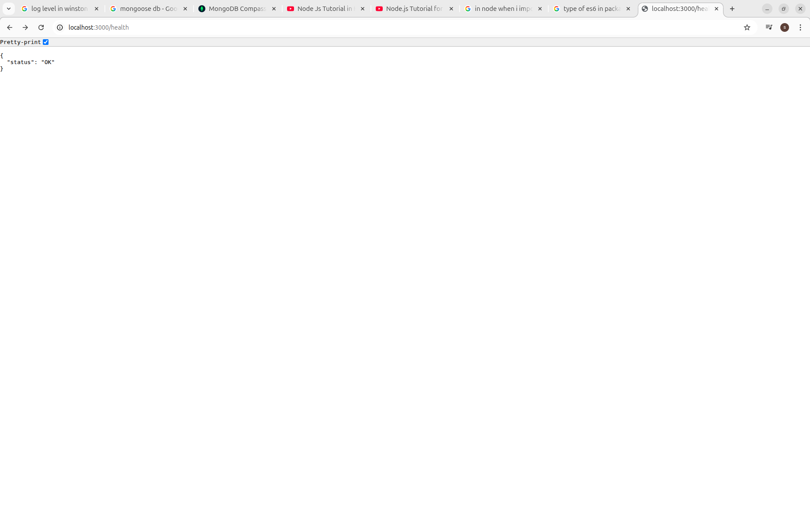

we are building a layered, predictable, enviornment-safe backend which is bootstrapped in order.

The role of each folder which we were told to create:

| folder       | role                                    |
| ------------ | --------------------------------------- |
| config       | App configuration (env, ports, DB URLs) |
| loaders      | Bootstrapping logic (startup order)     |
| models       | DB schemas                              |
| repositories | DB queries only                         |
| services     | Business logic                          |
| controllers  | Request -> Response                     |
| routes       | URL mapping                             |
| middlewares  | Express middlewares                     |
| utils        | Helpers (logger, constants)             |
| jobs         | Cron / background tasks                 |
| logs         | Log files                               |

config managment is important because we cannot hardcode db url, port or secrets so we use env based config loading and as we are working in local enviornment we will work on file <strong>.enev.local</strong> which is present in root folder.

hmne day1 mein 6 files create ki hai:

<ol>
<li>config/index.js</li>
<li>loaders/app.js</li>
<li>loaders/db.js</li>
<li>utils/logger.js</li>
<li>@/.env.local</li>
<li>@/test.js</li>
</ol>

<strong>config/index.js</strong>
used to load correct .env so that configs are exposed safely

<strong>logger.js</strong>
used to store all the logs of the server. this helps in debugging, monitoring and managing the project.

<strong>db.js</strong>
used to connect database

<strong>app.js</strong>
used to define startup order meaning creating and configuring the app.

<strong>test.js</strong>
temporary file used to check the working of each .js file we create

<h3>Our Startup Flow </h3>

```txt
Load environment configuration
        |
Initialize logger
        |
Connect database
        |
Initialize Express app
        |
Load middlewares
        |
Mount routes
        |
Start HTTP server
```

health screenshot


