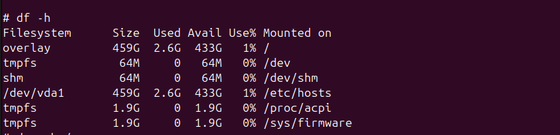
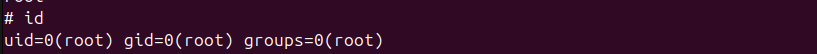

container accessed using:

```sh
docker exec -it day1-container /bin/sh
```

### Commands explored

`ls` list directory contents


`pwd` print working directory


`ls /` structure of root directory.


`ps` list running processes


`top` live process monitor


`df -h` disk usage space


`du -sh /app` total size of directory


`whoami` current user


`id` user identity details


Node app running inside container

Logs viewed using docker logs.
