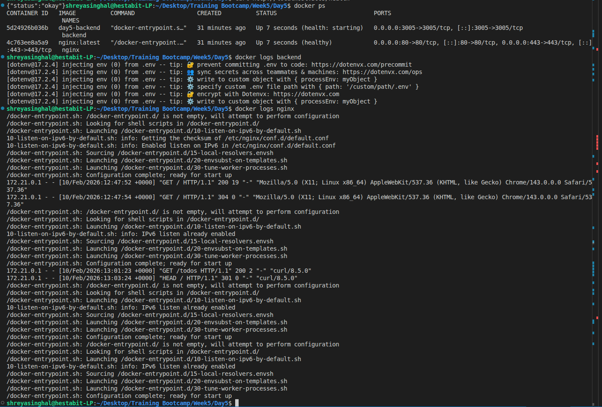
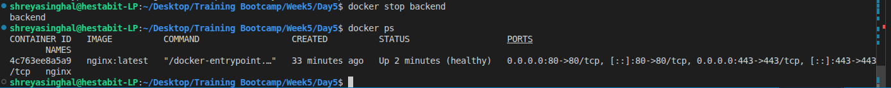

### SOME PART OF THE PROJECT IS LEFT. WILL COMPLETE IT BY TOMORROW. I JUST CHECKED THAT I DID SOMETHING WRONG. NEED TO UPDATE IT.

# Day5 Production Deployment Guide

## 1. Project Overview

- **Backend:** Express.js server with Todos APIs (`GET /todos`, `POST /todos`, `PATCH /todos/:id`)
- **Logging:** Winston + Morgan logging (daily rotated logs so nothing gets lost)
- **Reverse Proxy:** Nginx handles HTTPS and redirects HTTP to HTTPS
- **Deployment:** Dockerized using Compose with `dev` and `prod` profiles
- **Volumes:** Logs are saved on my machine so they stick around even if containers restart
- **Healthchecks:** Docker ensures backend is healthy before serving traffic

### Architecture Diagram

```
Browser <--HTTPS--> Nginx <--HTTP--> Backend
                    |
                 Logs volume
```

---

## 2. Environment

| Profile | Backend Port | Env File    | Notes                                    |
| ------- | ------------ | ----------- | ---------------------------------------- |
| dev     | 3005         | `.env`      | Can access backend directly on localhost |
| prod    | hidden       | `.env.prod` | Backend is only reachable via Nginx      |

### Secrets

- SSL certs are in `nginx/ssl`
- `.env.prod` has sensitive info.

---

## 3. Deployment Instructions

### Using the deployment script

```bash
# Only need to do this once
chmod +x scripts/deploy.sh

# Run it
./scripts/deploy.sh
```

### Or manually

```bash
# Stop old prod containers
Docker compose --profile prod down

# Build & start prod containers
Docker compose --profile prod up -d --build
```

---

## 4. How to check if it's working

### Check containers

```bash
docker ps
docker logs backend
docker logs nginx
```

- Backend logs: should say `"Backend is running on PORT 3005"`
- Nginx logs: should start without any errors



### Healthcheck

```bash
curl http://localhost:3005/health
```

- Status should be `"okay"`


### Test APIs through Nginx (prod)

```bash
curl -k https://localhost/todos
curl -k -X POST https://localhost/todos -H "Content-Type: application/json" -d '{"title":"test todo"}'
```


### Test HTTP → HTTPS redirect

```bash
curl -I http://localhost
# Should redirect to HTTPS
```


### Check if logs are saved

```bash
ls backend/logs
```

- Should see `app.log`, `error.log`, `access.log`
- Try restarting backend, logs should still be there


### Test restart policy

```bash
docker stop backend
docker ps
# Backend should come back up automatically
```



---
