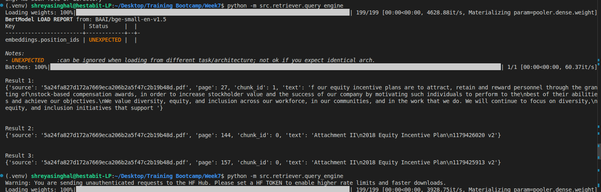
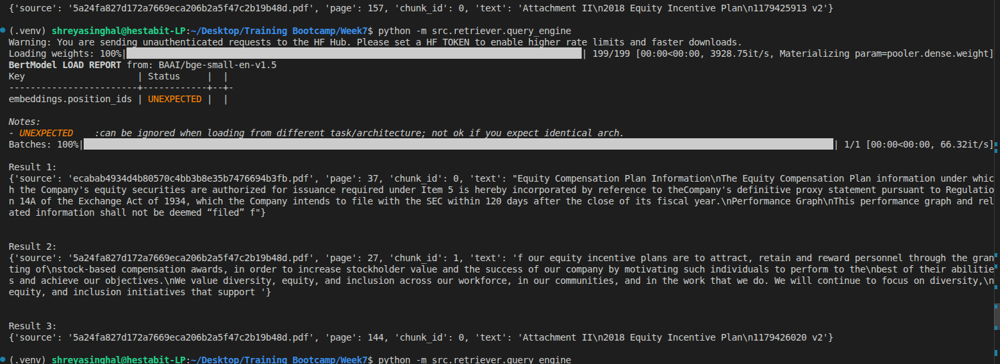
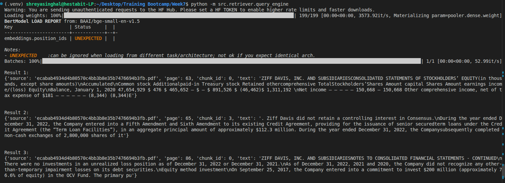

## DAY1 ARCHITECTURE

we are building a system which loads the document, make them searchable, and retrieves info for queries.

### WORKING FLOW

```bash
documents
   |
loader
   |
chunking
   |
embeddings
   |
vectorDB
   |
Retriever (User-Query)
```

### FOLDER DESIGN

```bash
Week7
|--- src
     |----pipelines
            |---------ingest.py
     |----embeddings
            |---------embedder.py
     |----vectorstore
            |---------store.py
     |----retriever
            |---------query-engine.py
     |----config
            |---------settings.yaml
     |----utils
     |----data
            |--------raw
            |--------cleaned
            |--------chunks
     |----models
     |----logs
     |----prompts
     |----generator
     |----evaluation
```

### FOLDER MEANINGS

| Name                      | Purpose                                             |
| ------------------------- | --------------------------------------------------- |
| data/raw                  | store original documents                            |
| data/cleaned              | store the cleaned data here (lowecase, remove junk) |
| data/chunks               | store seperate record for chunks                    |
| embeddings/embedder.py    | store embedding logic                               |
| vectorstore/store.py      | store FAISS index                                   |
| retriever/query-engine.py | store search logic                                  |
| pipelines/ingest.py       | orchestration layer                                 |

### SYSTEM FLOW

we have divided our project into two main phases

#### PHASE 1: INGESTION

runs when new documents are loaded, system is initialized once.

```bash
Documents
  |
Load
  |
Clean
  |
Chunk
  |
Embed
  |
Store in FAISS
```

### PHASE 2: QUERY

this is a runtime phase which runs each time a user asks a query.

```bash
Query
  |
Embed query
  |
Search FAISS
  |
chunks return
```

### WORKING SCREENSHOTS






